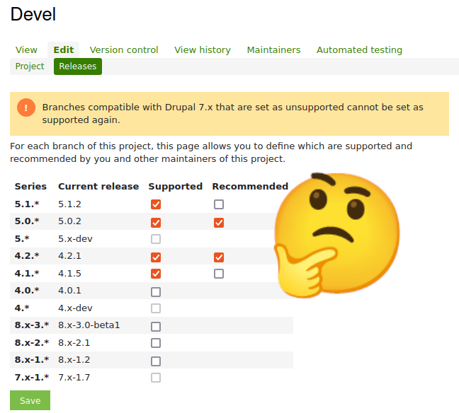

+++
title = "Proposing a Drupal 7 security team"
date = 2023-12-10
draft = true
[taxonomies]
tags = ["drupal", "drupal planet"]
+++



The Drupal Security Team has announced in [PSA-2023-06-07](https://www.drupal.org/psa-2023-06-07) that unsupported Drupal 7 modules/themes cannot be supported again. I'm proposing to create a D7Security team on Github that can provide security fixes for those unsupported modules. A small update module can then notify Drupal 7 site owners when new security releases are available on Github.

<!-- more -->

## Background

At my company [Jobiqo](https://www.jobiqo.com/) we are still running lots of Drupal 7 sites. Some will be upgraded to our Drupal 10 stack, but we expect that we will run many of those sites beyond the official support date of Drupal 7 on January 5, 2025.

We use around 220 Drupal 7 contributed projects that are published on drupal.org. Some of those modules we maintain ourselves in collaboration with the Drupal community, for many others we rely on the respective maintainers to publish security updates and PHP compatibility fixes.

Whenever a module that we use is about to get unsupported we want to step up as maintainers and continue the security support. The reasoning is simple: we need to maintain the code in-house anyway to keep our sites secure, so we might as well publish the fixes as proper releases for the community. If other companies do the same we profit from a shared ownership over the contributed projects.

## Blocked on unsupported projects

Stepping up as maintainers has worked well for us in the past, but now we are blocked from doing that on drupal.org. The Drupal Security Team wants to phase out support for Drupal 7 projects, so when a project gets unsupported it is policy to not mark it as supported again.

I have a lot of empathy for the Drupal Security Team: many of the members don't run Drupal 7 sites anymore and it can be a hassle to track down Drupal 7 module maintainers when preparing security releases. That's why they want to phase out Drupal 7 support where possible. I would love to unburden them by shifting the Drupal 7 security team work to a group of people that have an interest in running Drupal 7.

## Establishing an unofficial D7Security team on Github

In order to unburden the Drupal Security Team and the Drupal Infrastructure team I think it would be best to establish an unofficial Drupal 7 security team (let's call it D7Security team) on Github. I will describe later how we can communicate security releases from Github through the standard Drupal 7 update notification system.

The D7Security organization on Github would be completely independent of the Drupal Security Team with these benefits:

1. Drupal 7 modules can get unsupported on drupal.org, but releases (including security updates) can be made on Github. Maintainers and the security team don't have to feel guilty: D7Security will pick it up if it is used by a member company.
2. The Drupal Security team can publish any non mass-exploitable Drupal 7 vulnerability, as [is already policy](https://www.drupal.org/psa-2023-06-07). Then the D7Security team can pick it up.
3. For mass-exploitable remote code execution vulnerabilities the Drupal Security Team can reach out to the D7Security team with a warning even beyond January 5, 2025.

## Pushing update notifications from Github to Drupal 7 sites

The update notification system of Drupal 7 works with XML feeds that are downloaded from drupal.org ([example for devel module](https://updates.drupal.org/release-history/devel/7.x)). Luckily this update system is pluggable and we can apply some nice tricks to download update information XML from static Github files instead.

The rough workflow would go like this:

1. The unsupported module code is forked to a Github repository.
2. A fix is committed, a new git tag and a release is created on Github.
3. The update XML is crafted by hand (later automated) in a central Github repository pointing to the Github release ([dummy example for devel](https://github.com/klausi/d7sec_update/blob/main/devel/7.x)). The path `devel/7.x` is important as that will be appended by update module when fetching the XML.
4. The module is added to the list of supported modules on Github ([dummy example for devel](https://github.com/klausi/d7sec_update/blob/main/supported_projects.txt))
5. The Drupal 7 site operator installs a small helper module that fetches update information from Github on top of the default drupal.org source. The [example code](https://github.com/klausi/d7sec_client) for that is just a few lines of code:

```php
/**
 * Implements hook_update_projects_alter().
 */
function d7sec_client_update_projects_alter(array &$projects) {
  // Fetch the list of supported D7 projects from GitHub.
  $d7sec_supported = drupal_http_request('https://raw.githubusercontent.com/klausi/d7sec_update/main/supported_projects.txt');
  if ($d7sec_supported->code == 200) {
    $supported_projects = explode("\n", $d7sec_supported->data);
    foreach ($supported_projects as $supported_project) {
      $supported_project = trim($supported_project);
      if (isset($projects[$supported_project])) {
        // Replace the project update XML URL with our own, pointing to Github.
        $projects[$supported_project]['info']['project status url'] = 'https://raw.githubusercontent.com/klausi/d7sec_update/main';
      }
    }
  }
  else {
    watchdog('d7sec_client', 'Could not fetch supported projects list from GitHub: <pre>@error</pre>', [
      '@error' => print_r($d7sec_supported)
    ], WATCHDOG_ERROR);
  }
}
```

This will now show any new releases in the Drupal 7 backend as usual and trigger update notification emails.

The great benefit of this static file approach is that there are no update server operation costs.

One important thing missing here is the drupal.org packaging script which adds version information into the module's info file. I'm sure there are some other details as well that I have missed, but the approach should work in general.

## Why Github?

It should be possible to do a similar approach on drupal.org's Gitlab, but I think it could get very confusing where the actual replacement code for a module lives. I prefer Github for organization governance reasons, then it is easy to define repository access based on groups.

## Conclusion

This is currently a proposal that I would like to get feedback on. Feel free to reach out and discuss in the Drupal ideas issue (will link this soon).
