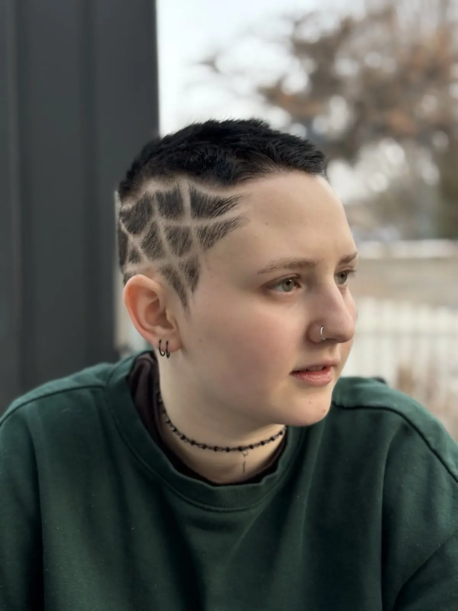

+++
title = "18 Monate"
date = 2026-02-20
[taxonomies]
tags = ["moony", "suicide"]
+++

**Triggerwarnung: Tod, Suizid**

Ich trauere um meinen Sohn [Moony](@/blog/2026-02-01-moony/index.md), der sich das Leben genommen hat. Dies ist ein weiterer Text in meiner Suche nach Umgang mit Selbstmord (Kategorie: [suicide](/tags/suicide)).

<!-- more -->

Ich habe Moony sehr geliebt. Ein Gespräch hätte ich noch gern mit ihm geführt, nur noch einmal nebeneinander sitzen wäre schön gewesen.

Wir haben uns zwar nur alle 2 Wochen am Wochenende gesehen, aber über den Zeitraum von 18 Jahren haben wir eine gute Beziehung aufgebaut (dachte ich). 26-mal pro Jahr, 7 Stunden am Stück, meistens Sonntag. Manchmal haben wir mehrere Tage zusammen verbracht, so wie bei Weihnachten oder Urlauben. Manchmal war einer von uns krank und wir mussten es ausfallen lassen. Im letzten Jahr wurde es weniger, weil Moony wegen den chronischen Schmerzen der Fibromyalgie früher abbrechen musste. Überschlagsmäßig war ich also 3.276 Stunden mit Moony zusammen, was wenig und viel zugleich ist.

Irgendwo habe ich mal eine Formel von Paartherapeut*innen aufgeschnappt, wie lange es braucht, bis das Ende einer Beziehung verarbeitet ist. Du nimmst die Anzahl der Jahre der Länge der Beziehung und dieselbe Zahl in Monaten ist der Zeitraum, den du benötigst um das Ende der Beziehung zu verarbeiten. Mir gefällt dieser Ansatz, weil er mir ein Gefühl gibt, wann die schlimmste Trauer vorbei sein wird. Also nach 18 Jahren mit Moony werde ich in 18 Monaten wieder mehr Normalität haben. Das Datum wird der 26. Juli 2027 sein.

Meine Emotionen sind vielfältig: Schuld, Versagen, Bedauern, Trauer, Verzweiflung, Wut, Resignation, Hoffnungslosigkeit, Scham, Enttäuschung, Frust, Müdigkeit. Am stärksten sind Schuld und Versagen, vielleicht schreibe ich dazu noch einen eigenen Text.

Moonys Selbstmord trifft mich in der stärksten Position meines Lebens, ich war glücklich und habe viel Rückhalt:
* Eine Partnerin, die ich sehr liebe und die mich trägt
* Meine Schwester, Eltern und Verwandten, die mich unterstützen
* Mein Freundeskreis, mit vielen starken Beziehungen und großer Anteilnahme
* Meine Firma, wo ich mich mit meinen Arbeitskolleg*innen sehr wohl fühle und ich Support und Freiraum bekomme
* Meine körperliche Gesundheit, ich wache jeden Tag schmerzfrei auf
* Meine mentale Gesundheit, ich war ausgeglichen und mit mir selbst zufrieden
* Meine finanzielle Situation, ich bin gut abgesichert
* Mein räumliches Umfeld, ich lebe in einer sehr schönen Wohnung in der lebenswertesten Stadt der Welt
* Erfahrung mit Selbstmord. Nach den beiden Suiziden meines Schulkollegen [Michael Steiner](@/blog/2000-01-13-michael-steiner/index.md) im Jahr 2000 und meines Freundes [Georg Dreier](https://trauer.kleinezeitung.at/traueranzeige/georg-dreier-9999) im Jahr 2018 kenne ich die Mechanismen und Phase danach.

Trotzdem tut es weh, um die Trauer komme ich nicht herum. Jeden Tag spielt sich in meinem Kopf dasselbe Nachdenken ab: was ist eigentlich passiert, warum ist es passiert, wie hätte ich es verhindern können. Ich weiß ganz genau, dass ich keine Antworten finden werde. Das war schon bei den vergangenen Selbstmorden so: ich will es verstehen, das braucht eine fixe Zeitspanne und nimmt Raum in meiner Aufmerksamkeit ein - eine Lösung wird es allerdings nie geben.

Als rationaler Mensch begehe ich unterbewusst einen schweren Fehler: ich wende die [5-Why-Methode von Toyoda Sakichi](https://de.wikipedia.org/wiki/5-Why-Methode) an:

> Wenn ein Problem auftritt, frage fünfmal warum, um die Ursache des Problems herauszufinden.

Warum hat sich Moony umgebracht?

Weil er starke körperliche Schmerzen hatte und mit Depressionen zu kämpfen hatte.

Warum hatte Moony starke Schmerzen?

Weil keine Therapie zur Behandlung der Schmerzen durchgeführt wurde.

Warum gab es keine Therapie?

Weil Moony für die Schmerzambulanz Klagenfurt nicht als akuter Fall eingestuft wurde. Ein Therapieplatz war nach Verzögerungen erst für Februar 2026 vorgesehen.

Warum wurde Moony nicht als akuter Fall eingestuft?

Weil Moony die Dringlichkeit seiner Situation nicht ausdrücken konnte und sich sehr zurückgehalten hat. Das Gesundheitssystem in Österreich ist mit komplizierteren Krankheiten wie Fibromyalgie überfordert. Nur wer sehr laut schreit, dem wird geholfen. Grüße gehen raus an dieser Stelle an alle mit Fibromyalgie, ME/CFS und ähnlichen Krankheiten, bitte haltet durch und ich hoffe euch wird geholfen.

Warum konnte Moony sein Leiden und seine Bedürfnisse nicht ausdrücken?

Weil Moony anderen nicht zur Last fallen wollte und ich das nicht erkannt habe.

Und schon zeigt die Ursache auf mich. Der perfekte Mechanismus, um sich schlecht zu fühlen. Ok, lass uns die 5-Why-Methode komplett zerlegen, damit ich mich wieder besser fühle:

1. Ein Selbstmord ist kein Business-Problem, überhaupt nicht mit fehlerhaften Prozessen bei einem Toyota-Fließband vergleichbar.
2. Nach 5-mal Warum bin ich noch nicht mal fertig? Warum nur 5 Warum und nicht 6, 7 oder 8? Ich könnte beliebig weiterfragen.
3. Die Kette an Warums ist nicht die einzige. Ich könnte einige weitere Warum-Stränge so durchgehen.
4. Ein Selbstmord hat viele Gründe, die nur Moony selbst komplett gekannt hat. Die Reduktion auf nur eine Ursache ist unvollständig.

Moment, habe ich gerade mit mir selbst argumentiert, um mich zuerst schlecht zu fühlen und mich dann selbst zu trösten? Wie viel Zeit ist überhaupt gerade vergangen?

Noch 18 Monate.

Ich vermisse dich Moony.
