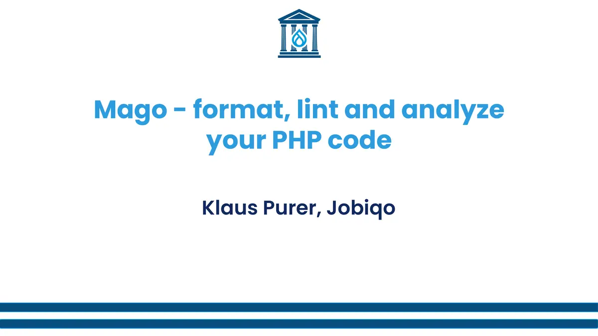

+++
title = "Mago presentation at Drupal Dev Days Athens"
date = 2026-04-23
[taxonomies]
tags = ["drupal", "drupal planet", "speaking", "english"]
+++

Here are [the slides](drupal-dev-days-2026-mago-format-code.pdf) of my [Drupal Dev Days presentation](https://devdays2026.drupal.org.gr/drupal-developer-days-athens-2026/session/mago-format-lint-and-analyze-your-php-code) about [Mago](https://mago.carthage.software/) in Athens. I will add the video recording here as soon as it is available.

<!-- more -->
