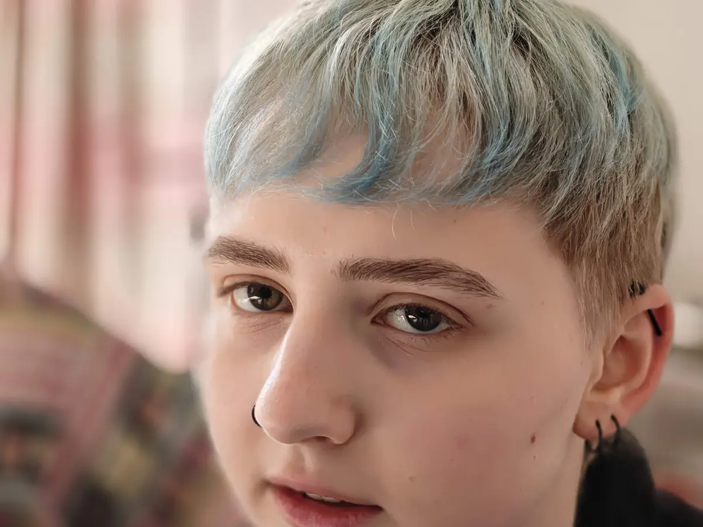

+++
title = "Schuld und Versagen"
date = 2026-04-26
[taxonomies]
tags = ["moony", "suicide", "german"]
+++

**Triggerwarnung: Tod, Suizid**

Mein Sohn [Moony](@/blog/2026-02-01-moony/index.md) hat sich das Leben genommen. In meiner Trauer ist dieser Text entstanden (weitere Texte in der Kategorie: [suicide](/tags/suicide)).

<!-- more -->

Diesen Text zu schreiben ist schwer. Er enthält Anschuldigungen, die der Situation bei einem Selbstmord nicht gerecht werden. Nach Moonys Tod hat mich ein Gefühl von Schuld und Versagen gequält, aber auch Wut auf Beteiligte und Enttäuschung über Moonys Entscheidung. Mir kommen immer wieder Gedanken über das Warum und Wieso, hier mache ich Platz dafür.

## Meine Schuld

Es gab zwei entscheidende Momente, die ich zutiefst bereue und wo ich mehr machen hätte müssen.

Ich habe Moonys chronische Krankheit (Fibromyalgie) lange unterschätzt, aber im Jahr 2025 verstanden, dass wir Eltern die fehlende Behandlung bei den ÄrztInnen dringend eskalieren müssen. Es gab keine Besserung und Moony ging es schleichend schlechter. Am 6. Juli 2025 besprach ich mit Moony und seiner Mutter die nächsten Möglichkeiten für Behandlungen bei Ärzt\*Innen. Mein Ziel war es, ab diesem Zeitpunkt mit Moony zu den Ärzt\*Innen zu gehen. Letztendlich habe ich den Termin im August 2025 bei der Schmerzambulanz in Klagenfurt dann wieder Moony und seiner Mutter überlassen. Ich wollte mich nicht zu stark einmischen. Ich war bei keinem einzigen medizinischen Termin dabei, habe mich nicht für Moony stark gemacht, habe nur passiv mitbekommen, wie die Schmerzambulanz Moony als nicht akut einstufte und auf die Warteliste setzte. Das war zu wenig.

Noch gravierender war [meine Fehleinschätzung am 14. Dezember, als ich über Social Media von Moonys Selbstmordversuchen erfuhr](@/blog/2026-03-22-almost-kms-many-times/index.md). Ich war schockiert und verwirrt. Klar, Moony hatte chronische Schmerzen, aber sonst war er doch ok? Reflexartig bot ich Moony meine Hilfe an, aber Moony bedankte sich nur höflich, dass er momenan keine Unterstützung brauchte. Ganz naiv habe ich ihm geglaubt. Ich ließ es darauf beruhen und ging nicht weiter auf das unangenehme Thema Suizid ein.

Zweimal falsche Zurückhaltung, fatalerweise.

## Eltern

Ich bin Moonys Mutter und Moonys Stiefvater zutiefst dankbar, was sie in 18 Jahren für Moony getan und geleistet haben. Moonys Mutter hatte ein sehr gutes Verhältnis zu ihm, sie hat ihm vertraut. Wie ich war sie naiv und ließ sich von Moony belügen was die Selbstmordversuche anging.

## ÄrztInnen

## FreundInnen

## Moony selbst
