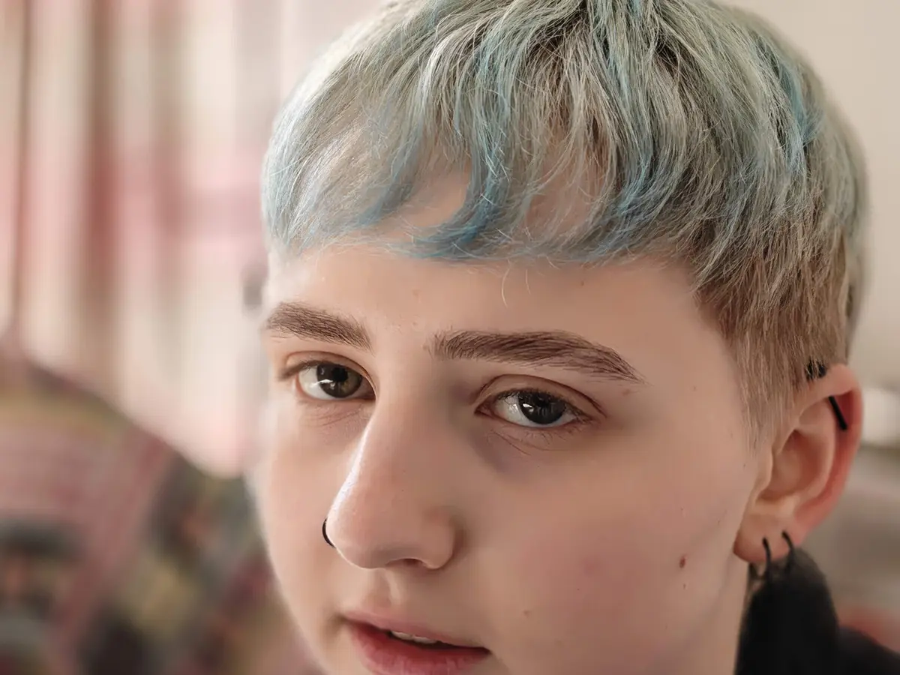

+++
title = "Schuld und Versagen"
date = 2026-09-27
[taxonomies]
tags = ["moony", "suicide", "german"]
+++

**Triggerwarnung: Tod, Suizid**

Mein Sohn [Moony](@/blog/2026-02-01-moony/index.md) hat sich das Leben genommen. In meiner Trauer ist dieser Text entstanden (weitere Texte in der Kategorie: [suicide](/tags/suicide)).

<!-- more -->

Diesen Text zu schreiben ist schwer. Er enthält Anschuldigungen, die der Situation bei einem Selbstmord nicht gerecht werden. Nach Moonys Tod hat mich ein Gefühl von Schuld und Versagen gequält, aber auch Wut auf Beteiligte und Enttäuschung über Moonys Entscheidung. Mir kommen immer wieder Gedanken über das Warum und Wieso, hier mache ich Platz dafür.

## Meine Schuld

Es gab zwei entscheidende Momente, die ich zutiefst bereue und in denen ich mehr hätte machen müssen.

Ich habe Moonys chronische Krankheit (Fibromyalgie) lange unterschätzt, aber im Jahr 2025 verstanden, dass wir Eltern die fehlende Behandlung bei den ÄrztInnen dringend eskalieren müssen. Es gab keine Besserung und Moony ging es schleichend schlechter. Am 6. Juli 2025 besprach ich mit Moony und seiner Mutter die nächsten Möglichkeiten für Behandlungen bei Ärzt\*Innen. Mein Ziel war es, ab diesem Zeitpunkt mit Moony zu den Ärzt\*Innen zu gehen. Letztendlich habe ich den Termin im August 2025 bei der Schmerzambulanz in Klagenfurt dann wieder Moony und seiner Mutter überlassen. Ich wollte mich nicht zu stark einmischen. Ich war bei keinem einzigen medizinischen Termin dabei, habe mich nicht für Moony stark gemacht, habe nur passiv mitbekommen, wie die Schmerzambulanz Moony als nicht akut einstufte und auf die Warteliste setzte. Das war zu wenig.

Noch gravierender war [meine Fehleinschätzung am 14. Dezember, als ich über Social Media von Moonys Selbstmordversuchen erfuhr](@/blog/2026-03-22-almost-kms-many-times/index.md). Ich war schockiert und verwirrt. Klar, Moony hatte chronische Schmerzen, aber sonst war er doch ok? Reflexartig bot ich Moony meine Hilfe an, aber Moony bedankte sich nur höflich und sagte, dass er momentan keine Unterstützung brauchte. Ganz naiv habe ich ihm geglaubt. Ich ließ es darauf beruhen und ging nicht weiter auf das unangenehme Thema Suizid ein.

Zweimal falsche Zurückhaltung, fatalerweise.

## Eltern

Ich bin Moonys Mutter und Moonys Stiefvater zutiefst dankbar für das, was sie in 18 Jahren für Moony getan und geleistet haben. Moonys Mutter hatte ein sehr gutes Verhältnis zu ihm, sie hat ihm vertraut. Wie ich war sie naiv und ließ sich von Moony belügen, was die Selbstmordversuche anging. Ich kann hier aber nicht mal einen Vorwurf formulieren. Wir Eltern sind für unsere Kinder verantwortlich und schützen sie, wo wir können, aber das geht halt nur, wenn es die Kinder zulassen und annehmen. Irgendwie sind wir schuld, aber ratlos, warum.

## Ärzt*Innen

Ich habe ja schon [in meinem 2. Text](@/blog/2026-02-20-18-monate/index.md) erwähnt, wie das Gesundheitssystem in Österreich mit komplizierteren Krankheiten wie Fibromyalgie überfordert ist. Moony ging mit seiner Mutter über viele Jahre zu verschiedenen Ärzt\*Innen, Psychotherapeut\*Innen, Spezialist\*Innen etc. in Österreich und in Deutschland – relativ erfolglos. Alle Therapien und Versuche sind fragmentiert, niemand vom medizinischen Fachpersonal hat den kompletten Überblick, was schon versucht wurde. Jedes Mal muss der Leidensweg neu erklärt werden. Dazu kommen abwertende Kommentare wie "Fibromyalgie habe ich bei einem 18-Jährigen noch nie gesehen!" von einer Rheumatolog\*In. Ja, 80 % der Fibromyalgie-Patient\*Innen sind Frauen im Alter zwischen 40 und 60, aber Fälle bei Kindern und Jugendlichen sind bekannt und gut dokumentiert.

Die Dringlichkeit von Moonys Zustand wurde auch nicht erkannt. Folgende Fakten lagen vor:
* Chronische körperliche Schmerzen (Fibromyalgie)
* Depression
* Gender Dysphoria (Moony war transgender)
* Selbstverletzung (Schnitte an den Beinen)

Jeder einzelne dieser Faktoren erhöht das Risiko für Selbstmord. Die Kombination sollte alarmierend sein; es bestand dringender Handlungsbedarf, Moony zu helfen. Hier passiert eine krasse Fehlentscheidung in der Schmerzambulanz im Krankenhaus Klagenfurt im Sommer 2025: Statt sofort eine Behandlung zu starten, wird Moony nur auf die Warteliste für einen Platz in der Schmerzambulanz gesetzt. Als endlich ein Platz im Februar 2026 frei wird, ist es zu spät: Moony hat sich am 26. Jänner 2026 das Leben genommen.

Ich habe lange überlegt, ob ich beim Krankenhaus Beschwerde einlegen soll. Letztendlich konnte ich mich nicht dazu durchringen. Das Gesundheitssystem als Ganzes hat versagt; eine Beschwerde mit einzelnen verantwortlichen Personen auszutragen, fühlt sich falsch an. Ich kann nicht einschätzen, ob Moony das gewollt hätte.

## Die Krankheit

Moony hatte permanent körperliche Schmerzen in den Muskeln, Gelenken und dem gesamten Bewegungsapparat. In den letzten 2 Jahren kannte Moony nur mehr 2 Zustände: Schmerzen oder sehr starke Schmerzen. Für mich ist es nur schwer nachvollziehbar, wie anstrengend und zermürbend dieser Dauerzustand mit Schmerz sein muss. Moonys Verzweiflung war groß, in seinem Abschiedsbrief schrieb er, dass er keine Energie mehr hat und nicht sein restliches Leben krank sein will.

Ich wünschte, er hätte dieses Ultimatum nicht erst in seinem Abschiedsbrief ausgedrückt. Eine Chance noch, einen Versuch noch, einmal noch was probieren.

Mit diesen letzten Worten sagt uns Moony, dass die Krankheit Fibromyalgie die Schuld an seinem Tod trägt.

## Testosteron und der Urologe

Als transgender Person hatte sich Moony die Hormontherapie mit Testosteron erkämpft. Es war der glücklichste Tag für ihn im Jahr 2025, als er die erste Testosteronspritze bekam. Unsere Hoffnung war, dass das Hormon nicht nur bei der Angleichung seines Geschlechts helfen würde, sondern auch eine Verbesserung bei der Fibromyalgie bewirken könnte. Diese Erleichterung ist nicht eingetreten.

Ich konnte zumindest keine weitere Verschlechterung von Moonys psychischer Gesundheit feststellen. Hat ihm das Testosteron mehr Mut gegeben, den Selbstmord durchzuziehen? Kann niemand beantworten, bitte haltet euch mit Spekulationen zurück.

Aus der Transgender-Community weiß ich, dass die Gesundheitsversorgung mit Hormontherapie sehr wichtig ist, um Selbstmorde bei transgender Personen zu verhindern. Den Urologen trifft also überhaupt keine Schuld.

## Freund\*Innen

Moony hatte einen vielfältigen und bunten Freundeskreis, der ihm sehr wichtig war. 2 davon wussten von einem Selbstmordversuch schon am Vortag seines Todes, wir Eltern nicht. "Gut dass du noch da bist Digga" war eine Textnachricht nur direkt an Moony. Ich kenne das: Ich war selbst als 16-Jähriger in einer ähnlichen Situation, als mein Klassenkollege [Michael Steiner](@/blog/2000-01-13-michael-steiner/index.md) seinen Selbstmord scherzhaft angekündigt hat. Ich konnte nicht damit umgehen und habe das ignoriert – dann war Michael tot.

Hätten wir etwas verhindern können, wenn Moonys Freund\*Innen uns aufmerksam gemacht hätten? Wahrscheinlich nicht, nur wenn Moony es zugelassen hätte.

## Moony selbst

Jetzt sind wir am schwierigen Ende angekommen. Moony hatte kalkuliert. Moony hatte sich vorbereitet, wann und wie und wo er welche Schritte setzen musste. Es wirkte wie von langer Hand geplant, irgendwo abgespeichert, sodass er nur noch den Entschluss zur Ausführung fassen musste.

Das war kein Hilfeschrei. Er hatte schon abgeschlossen. Er hatte kühl gelogen, was seinen Aufenthaltsort betrifft.

Ich bin sehr froh, dass Moony einen Abschiedsbrief hinterlassen hat. Der lässt nicht viel Raum für Spekulationen: Das Motiv ist die Krankheit und die fehlende Zukunftsperspektive.

Die Intention ist kristallklar. Moonys Tod ist seine eigene volle Absicht. Damit ist die eigentliche Schuld freigelegt, all die Worte von zuvor verschwinden als Hintergrundrauschen.

Ich kann Moonys Selbstmord nicht akzeptieren, ich kann nur ignorieren. Meine Suche nach Schuld wiederholt sich immer wieder in meinem Kopf, fast jeden Tag. Ich will mir eine Erklärung bauen, was mir aber nicht gelingt. Das Versagen ist meine Trauer.

Noch 10 Monate.

Ich vermisse dich Moony.

{{ <mastodon_comments id="117344217158535140" /> }}
